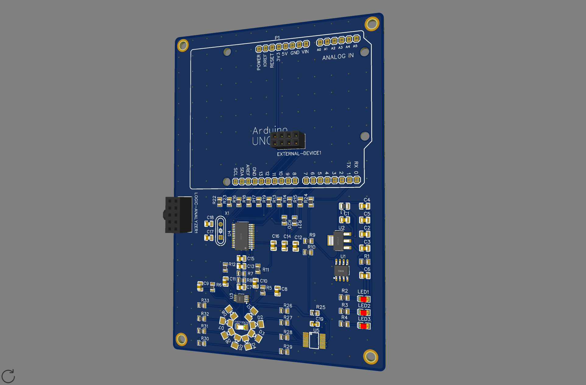

# DB2.0-Hardware

Hi and welcome to the hardware package of the Development Board 2.0
this repository is meant to host files and have releases. 

Learn more about the development board by visiting our [documentation page](https://docs.plasticscanner.com/boards/DB2.0).  
Find the firmware for the development board [here](https://github.com/Plastic-Scanner/DB2.0-Firmware)

## Naming

Full name: Development Board 2.0.  
Abbriviation: DB 2.0.  
Codename: Biege.  

## Status

not released yet.
##
