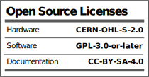

# DB2.x-Hardware

>CAUTION  
This is still an early development prototype. We recommend all makers, hackers and contributors to wait until the next development board release, where we will focus on making it reproducible and invite everyone to collaborate on.  

Hi and welcome to the hardware package of the Development Board 2.x
this repository is meant to host files and have releases. 

Learn more about the development board by visiting our [documentation page](https://docs.plasticscanner.com/boards/DB2.2).  
<!-- Find the firmware for the development board [here](https://github.com/Plastic-Scanner/DB2.x-Firmware) -->

